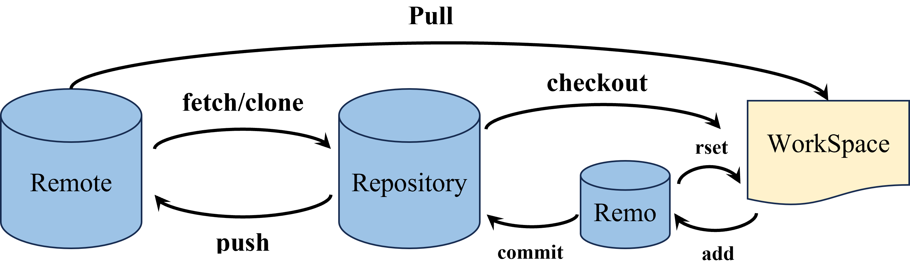
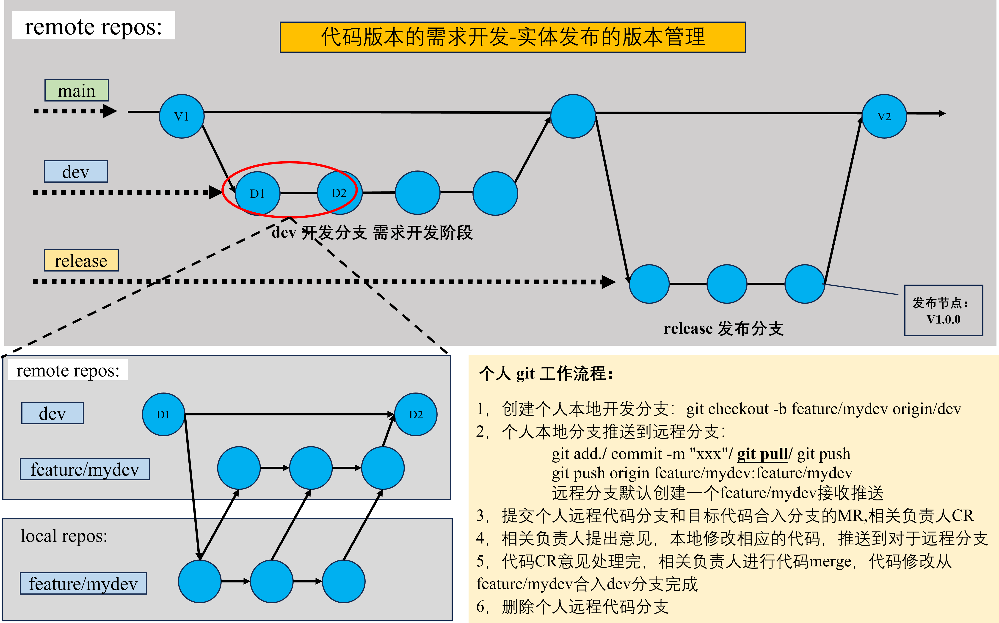

# 此仓库用于 gitup 学习

## 下图为git版本对三个区域的命令控制流程图：

## 下图为git个人对企业项目代码进行操作流程图
	这里只列出对 dev 分支的添加需求工作流程图 
	对用于发布的release分支和用于热补丁hot的分支，及其他分支工作方式 类似 

# 以下是个人学习github的总结，便于日常查看：

## 准备工作：
#### 1, git 安装
#### 2, 打开 git bash
#### 3, git 公私钥配置- 一个公钥代表一个客户端
	a) ssh-keygen -t rsa -C "注册邮箱名称" (如:5832@qq.com)
	b) 生成ssh通信用的公钥文件 - /c/User/(用户名)/.ssh/id_rsa.pub
	c) 第一次配置会让你写生成的文件名称（可以不写，一直回车，默认生成id_rsa.pub
	d) 打开github仓库，设置-> SSH and GPG keys-> new SSH key
	e) 将生成的公钥文件内容，复制粘贴到 new SSH key 的设置中
#### 4, 通信验证：
	终端命令：ssh -T git@github.com 验证是否能够通信
	期望结果：Hi (用户名)！You`ve successfully authenticated.
#### 5, 配置用户名和邮箱：
	以后在github的提交，都会附上你的用户名和邮箱 
	用户名设置：git config --global user.name "客户端名称"
	邮箱设置  ：git config --global user.email "邮箱"
#### 注意：以上过程windows 和Linux 系统操作是一样的
	Linux 通过 sudo apt-get install git /...install openssh-server 安装git

## git 常用命令：
### 1, 基础操作：
#### git clone 
	<远程仓库ssh地址> : 将远程仓库的文件克隆到本地
	命令执行后，会自动创建： 
	a) 定义本地仓库连接的远程仓库的名称：一般为origin (通过 git remote 查看），后面提交代码用
	b) 在本地的仓库定义一个主干分支，名称默认等于远程仓库分支名称（main)(通过 git branch -r)
#### git remote	
	查看本地仓库连接的远程仓库名，一般默认为 origin 
#### git log	
	查看当前分支当前版本以及之前的版本修改记录 
#### git status	
	文件修改后，查看工作区状态（当前文件夹中的文件都处于什么状态） 
#### git add	
	./		: 把工作区所有未提交的文件，提交的分支暂存区 
	<file>	: 把工作区文件<file>, 提交到分支暂存区 
#### git commit -m 
	"文字说明"	:把暂存区文件提交到仓库所在的分支上 
#### git push 
	<远程仓库名> <要推送的本地分支>:<远程分支>    	: 将本地仓库更新的代码推送到远程仓库 
	-f <远程仓库名> <要推送的本地分支>:<远程分支>  	: 将本地仓库更新的代码推送到远程仓库(强制)，一般用于，放弃远程仓库代码，或者回退远程分支版本 
	<远程仓库名> (空格):<远程分支> 		: 删除远程分支 
#### git pull	
	从当前分支连接的远程分支中拉取代码 

### 2, 分支管理
#### git checkout 
	-- <filename> 	: 用本地仓库的文件覆盖工作区的文件(当前工作区文件/内容覆盖掉)
	-b <name>     	: 创建名为<name>的分支，并切换到该分支
	<branch name> 	: 切换分支
#### git restore --staged
	<filename>    	: 将暂存区的文件回退到工作区
#### git reset HEAD
	（空白）			: 将所有暂存区文件退回到工作区。
	<file>			: 将暂存区文件<file>退回到工作区。用于错误文件误添加(git add)到暂存区。
	--hard <branch 版本号> 	: 将当前分支版本回退到分支的之前版本。用于错误文件误提交(git commit)到本地仓库。这个操作不会删除错误版本号。可以通过其他方式回倒你错误的版本。
#### git branch 
	（空白）  			: 查看本地分支
	<name> 				: 创建一个名为<name>的分支。功能=git checkout -b <name>。这里仅创建，不切换。
	<name> <远程仓库名>/<远程分支名> 	: 创建一个名为<name>的分支，并使其与远程分支<远程分支名>关联。
	-u <远程仓库名>/<远程分支名>  	: 使当前分支与远程分支<远程分支名>关联。
	-d <branch name>		: 删除分支 <branch name>。若被删除分支与主分支不同步，删除失败。
	-D <branch name>		: 强制删除分支<branch name >。即使与主分支不同步，强制删除。
	-r     				: 查看远程分支
	-a     				: 上述同时查看
	-vv    				: 查看当前分支连接的远程分支
#### git merge <branch name> 
	功能 	: 将分支<branch name>合并到当前的分支上，成为当前的下一个版本。
	用法	: 用于再分支上修改好代码，然后合并到主分支。通过主分支推送到远程仓库。目的是防止主分支误操作。

### 3, 其他
#### git init		
	把一个文件初始化为本地仓库。
#### git diff HEAD 
	-- <file>	: 查看工作区文件和仓库中该文件的差异。
#### git reflog 
	查看操作记录。可配合git reset -- hard用于撤回误操作（如误删某个版本）。

## 冲突解决：
#### 场景1：
	描述 : 两人git pull 同一个远程仓库分支版本 V1, 其中一人小张修改完先推送，V1->v2。其后小徐也修改完成，开始推送：系统报错（强制推送会覆盖小张修改）
		a) 两人修改非同一处，即可合并。
		b) 两人修改同一处，上述操作到git pull 会提示自动合并失败，请手动解决。
  	解决 :  
   		修改不为同一处，git会自动合并。
     		两人修改同一处，执行git pull 后，打开冲突文件，手动修改。
   		注意：这里执行git pull 后，git虽然提示自动合并失败，但会在冲突的文件中，自动将冲突的地方都放上去。

#### 场景2 : 合并冲突
	描述 : 主分支 main 在版本V1 创建分支 bran, 之后两个分支同时进行修改，并且修改为同一处。此时分支合并。
	冲突 : bran分支修改的内容和main修改同一处，合并时产生冲突。
	解决 :
	     修改不为同一处，git会自动合并。<
	     修改同一处，会在执行git merge后，不同修改内容会同时出现在本修改的文件中，需要打开文件进行手动修改。

## 注意：
1, 本地仓库落后于远程仓库的版本，无法通过git push 提交, 可以使用 git push -f 强制提交覆盖。
-
